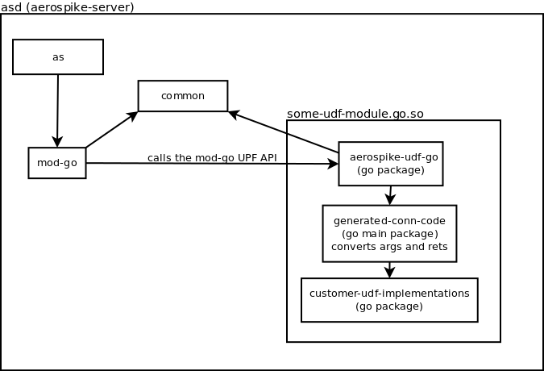

# aerospike-mod-go

**This project is experimental and should NOT be used in production. Git history will be rewritten.**

`aeospike-mod-go`, or simply `mod-go`, adds support for executing UDF's (User Defined Functions) using the Go language in the Aerospike database.

This Readme contains some documentation and thoughts on the work in progress, also a lot of notes-to-self.

### Related repo's
I have forked some repositories from aerospike that needed changes to make it all work. In all forks there will be a branch `mod-go` containing the changes for Go UDF.

 - [GeertJohan/aerospike-server](https://github.com/GeertJohan/aerospike-server) `mod-go` - The server itself, ofcourse.
 - [GeertJohan/aerospike-common](https://github.com/GeertJohan/aerospike-common) `mod-go` - Small changes were required to expose locking for mod-lua and mod-go separately
 - [GeertJohan/aerospike-mod-lua](https://github.com/GeertJohan/aerospike-server) `mod-go` - Adapt to the new way of locking the module.
 - [GeertJohan/aerospike-udf-go](https://github.com/GeertJohan/aerospike-udf-go) `master` - Go package and command to create Go UDF `.so` files.
 - [GeertJohan/aerospike-mod-go](https://github.com/GeertJohan/aerospike-mod-go) `master` - This repository, contains the mod-go module.

## UDF-module's

A UDF-module implemented in Go is uploaded to the aerospike server (`asd`) as shared-object (`.so`). It is then loaded and used by `mod-go` during runtime. This means that the sources must be compiled manually before being uploaded to the server.

https://github.com/GeertJohan/aerospike-mod-go/tree/master/docs/udf-module.png

### Reflection vs generated code

There are two approaches to registering arbitrary functions in a UDF module. The first one is to accept `interface{}` and use reflection to call the function at runtime. The second is to generate code that detects registrations and directly calls the function. I found that using reflection wasn't as simple as initially thought, and would have a lower performance than generated code. Therefore, initial implementation uses generated code.

### Registry vs cgo-exported

There are two ways to expose the UDF's in a module to mod-go in `asd`.
 - Maintain a map of names > functions, have a single entry point in Go that looks up the function by name and calls it with given arguments.
 - Generate [cgo-exported](http://golang.org/cmd/cgo/#hdr-C_references_to_Go) functions that directly call the UDF.

The first one is a lot easier for me to implement, the second one will probably have somewhat increased performance (no map lookup).
Initial implementation uses the first approach, but I should definitely investigate the second option.

### Exported API (v1.x)

The aerospike server expects that the shared-object exports a c-style API. All API functions are prefixed by `aerospike_udf_go_` to avoid accidental collisions.

#### `int aerospike_udf_go_get_api_version_major()`

Indicates the API version that is implemented by the connection package. Currently, the only valid version number is `1`. Please note that the v1 API is still in development and breaking changes can (will) be made. When released, there can never be any breaking changes to the v1 API. Additions can be made under a minor version increment (see next func).

#### `int aerospike_udf_go_get_api_version_minor()`

The minor version can be used to add new features to the API in a comptible manner. A new feature will only be used when both the UDF and the server have implemented the newer version.

#### `char* aerospike_udf_go_get_property(char*)`

Introduced in `v1.0`.

The `get_propery` function is used to obtain a number of key/value properties from the UDF-module. When a property is not implemented, the function must return an empty string. Otherwise the function must return a string value, which could also be empty.

The memory allocations for the returned values are freed by mod-go.

Implemented properties in v1.0.x:
 - `conn-name`: Returns the name of the used connection package.
 - `conn-version`: Returns the version string for the used connection package.
 - `go-version`: Returns the go version used to build the UDF-module.
 - `suports-dlclose`: Go1.5 `-buildmode=c-shared` does not support `dlclose`, so it will be impossible to unload outdated Go UDF-modules. This property is added right away for future compatibility. When returns `true, the loaded UDF-module supports dlclose.

#### `int aerospike_udf_go_setup()`

Introduced in `v1.0`.

`aerospike_udf_go_setup` must be called before any apply functions are called.
When the return value is not 0, an error has occurred during setup and the UDF-module should not be used.

#### `int aerospike_udf_go_apply_single(char* name, ...)`

Introduced in `v1.0`.

TODO

#### `int aerospike_udf_go_apply_stream(char* name..)`

Introduced in `v1.0`.

TODO

## Writing and uploading a UDF-module.

TODO

## libmod_go module for Aerospike

### Dependencies

TODO

### Build

To build the test app:

	$ make test

To build a static archive `libmod_go.a`:

	$ make libmod_go.a

To build a dynamic library `libmod_go.so`:

	$ make libmod_go.so

### Install

All generated files are placed in `./target/{arch}`, where:

- `{arch}` is the target architecture, e.g., `Linux-x86_64`.
- The `lib` subdirectory contains all libraries.
- The `bin` subdirectory contains all executables.

#### libmod_go.so

You will want to either:

1. Move the `libmod_go.so` to a location your program can access.
2. Add the path to `libmod_go.so` to your `LD_LIBRARY_PATH`.

### Test

To test, you can run the following:

	$ export LD_LIBRARY_PATH=$LD_LIBRARY_PATH:target/Linux-x86_64/lib
	$ target/Linux-x86_64/bin/test record test1.record a b c d
